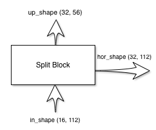
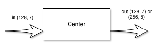
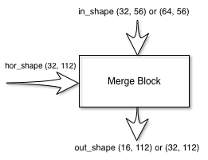
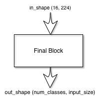

# Hassle Free UNet Implementation

[](https://travis-ci.org/thomasjpfan/pytorch_unet)

Constructing a `UNet` requires you to keep track of every signal size that flow through the UNet. This can lead to size mismatches when constructing the 
neutral network. To remedy this issue, I created a small PyTorch UNet module 
that calculates the sizes for you. You can even customize the building blocks 
used to construct the `UNet`.

## Installation

Install PyTorch following instructions on their [website](http://pytorch.org). Then install this package:

```
pip install git+https://github.com/thomasjpfan/pytorch_unet.git
```

## Usage

The UNet architecture, introduced in this [paper](link), has the following 
structure:


The primary use for a `UNet` is to perform segmentation. In the above case, the 
UNet is used to detect cancerous regions in the input image. There are four 
blocks to constructing a `UNet`: split, center, merge, and final blocks. My implementation of UNet has the following initialization method:

```python
class UNet(nn.Module):

    def __init__(self, *, 
                 input_shape, 
                 num_classes,
                 layers=4,
                 features_root=16,
                 split_block=SplitBlock,
                 merge_block=MergeBlock,
                 center_block=CenterBlock,
                 final_block=FinalBlock,
                 double_center_features=True):
                 ...
```

You can alter any of the four blocks used to generate the `UNet`. The `layers` parameter determines how tall the UNet is. For example, the image above has four layers. Each split layer upscales the signal to `2**layer*features_root` where `layer` is the zero-indexed layer number.

I will use the short hand, `(features, size)`, in my diagrams to denote the shape `features x size x size` of my signals. For example, `(112, 32)`, means the signal has the shape `112x32x32`.

### Split Block

The split block has two outputs and one input:



The shapes of the outputs are calculated for you, all you have to do is 
provide your custom implementation of the split block. For reference, here is 
the default `split_block` implementation:

```python
class SplitBlock(nn.Module):

    def __init__(self, in_shape, up_shape, hor_shape, layer):
        ...

    def forward(self, x):
        ...
        return self.max_pool(hw), hw
```

The extra `layer` index is passed in, just in case you want to adjust the block for different layers. To create your custom implementation, just copy the `SplitBlock` implementation and change the bodies of `__init__` and `forward`. Make sure that the `forward` call returns two values, the first being the `up` signal and second being the `hor` signal. The parameters `{}_shape` uses the convention `(features, size)`. You can use these parameters to perform assertions on the signal shapes during 
initialization.

### Center Block

The center block has one input and one output:



This block does not change the size of the signal, only the number of features change. Thus the default `center_block` implementation just needs the feature number:

```python
class CenterBlock(nn.Module):

    def __init__(self, in_feats, out_feats):
        ...

    def forward(self, x):
        return self.layers(x)
```
If `double_center_features` from `UNet` initialization is `True`, `out_feats` is two times `in_feats`, otherwise they are the same.

### Merge Block

The merge block has two inputs and one output:



The default implementation of this block is:

```python
class MergeBlock(nn.Module):

    def __init__(self, in_shape, out_shape, hor_shape, layer):
        ...

    def forward(self, x, hor):
        return out
```

The `in_shape` and `out_shape` parameters depends on the `double_center_features`. If the features were doubled at the center block, the features going down the merge block will also be doubled. `forward` takes in 
two inputs and outputs one signal.

### Final Block

The final block has one input and one output:



The default final block just has a single convolution layer:

```python
class FinalBlock(nn.Module):

    def __init__(self, in_feats, out_feats):
        self.layer = nn.Conv2d(in_feats, out_feats, kernel_size=1)

    def forward(self, x):
        return self.layer(x)
```

The final block outputs a signal of size `(num_classes, input_size)`, which 
which was passed into `UNet` initialization. Each pixel is given a logit value
for each class. This can transform to a probability by using a sigmoid layer.
